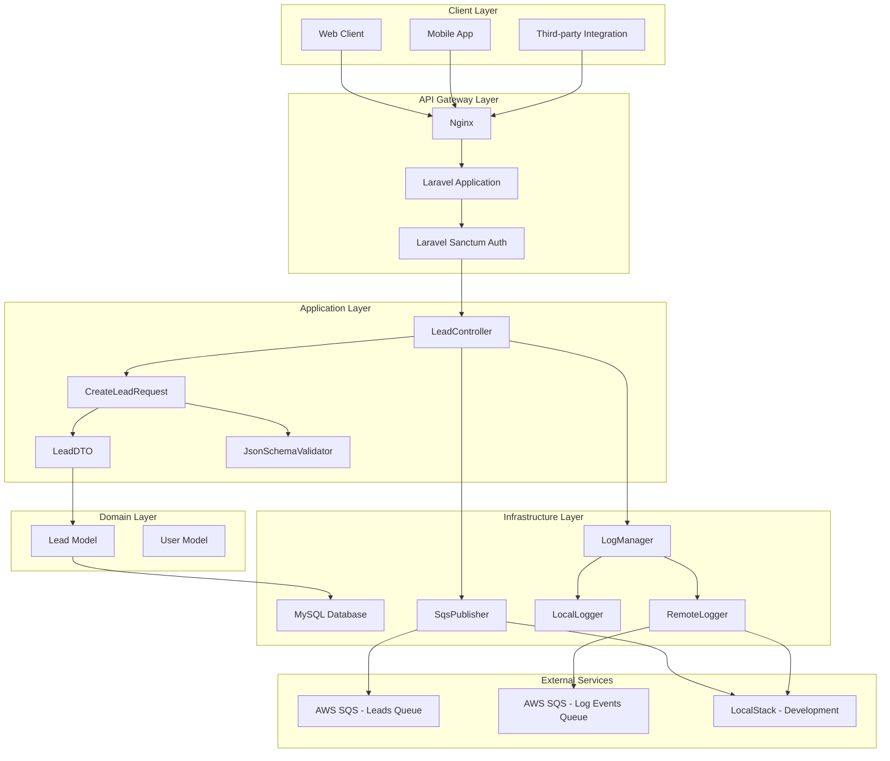
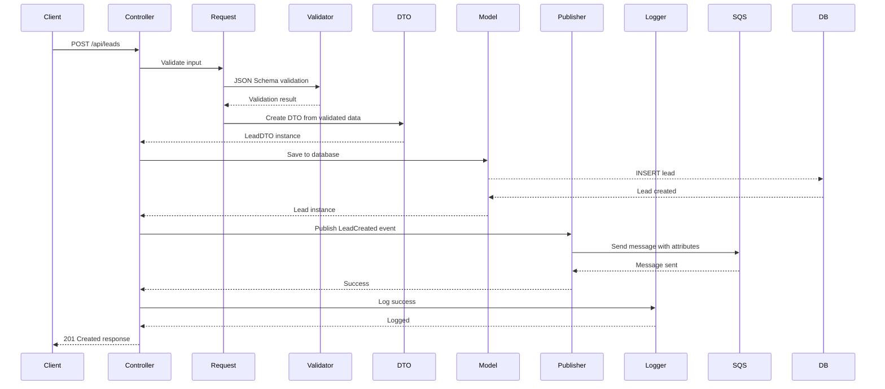
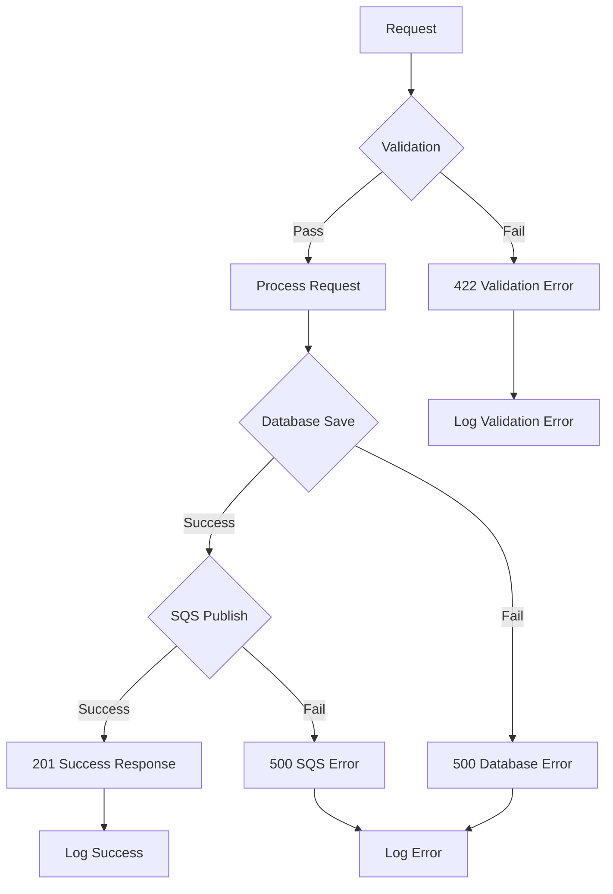
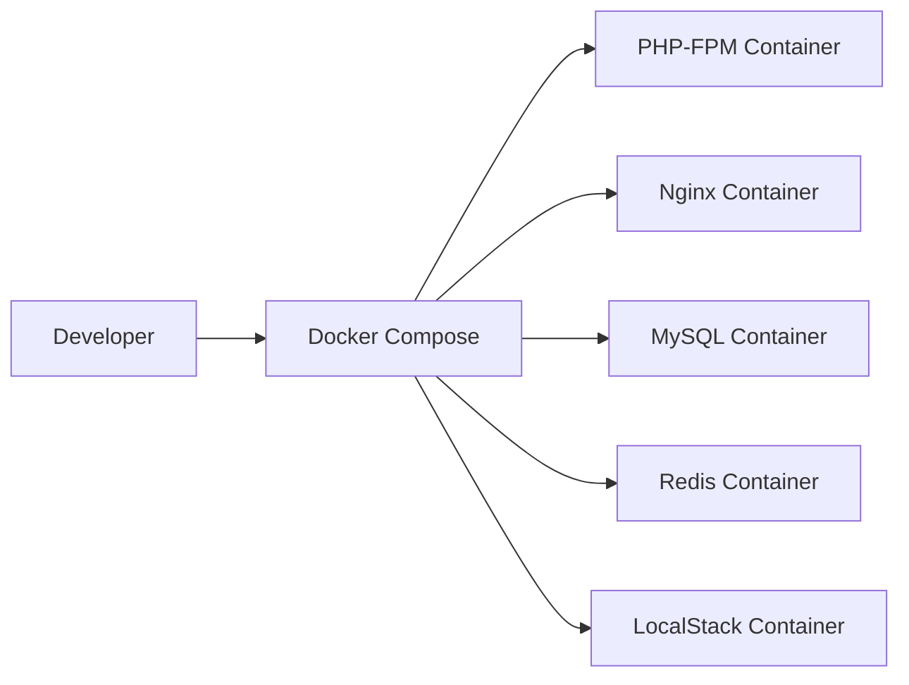
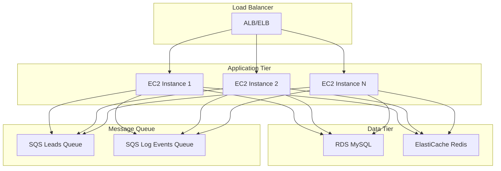

# Architecture Documentation

## System Overview

The PHP CRM Gateway is a Laravel 11 API that serves as a gateway for lead management with AWS SQS integration and switchable logging capabilities. It follows clean architecture principles with clear separation of concerns.

## Architecture Diagram



## Component Interaction Flow



## Design Patterns

### 1. Clean Architecture

The application follows clean architecture principles with clear layer separation:

- **Presentation Layer**: Controllers, Requests, Routes
- **Application Layer**: Services, DTOs, Use Cases
- **Domain Layer**: Models, Business Logic
- **Infrastructure Layer**: Database, External APIs, Logging

### 2. Data Transfer Object (DTO) Pattern

```php
class LeadDTO
{
    public function __construct(
        public readonly string $tenantId,
        public readonly string $correlationId,
        public readonly string $email,
        // ... other properties
    ) {}
    
    public static function fromArray(array $data): self
    public function toArray(): array
    public function toDatabaseArray(): array
    public function toSqsMessage(): array
}
```

**Benefits:**
- Type safety and immutability
- Clear data contracts between layers
- Easy serialization for different outputs
- Prevents data leakage between layers

### 3. Strategy Pattern (Logging)

```php
interface LoggerInterface
{
    public function info(string $message, array $context = []): void;
    public function error(string $message, array $context = []): void;
    // ...
}

class LogManager
{
    public function getLogger(): LoggerInterface
    {
        return match ($this->logMode) {
            'remote' => new RemoteLogger($this->messagePublisher),
            'both' => new CompositeLogger(new LocalLogger(), new RemoteLogger($this->messagePublisher)),
            default => new LocalLogger(),
        };
    }
}
```

**Benefits:**
- Runtime switching between logging strategies
- Easy to add new logging destinations
- Consistent interface across all strategies
- Testable and maintainable

### 4. Repository Pattern (Implicit)

While not explicitly implemented, the pattern is followed through:
- Eloquent models as repositories
- Service classes handling business logic
- Clear separation between data access and business logic

## Data Flow Architecture

### Request Processing Flow

1. **Authentication**: Laravel Sanctum validates API token
2. **Validation**: FormRequest performs Laravel validation
3. **Schema Validation**: JSON Schema validates data structure
4. **DTO Creation**: Validated data converted to typed DTO
5. **Database Storage**: Lead saved to MySQL with transaction
6. **Event Publishing**: LeadCreated event sent to SQS
7. **Logging**: Success/error logged based on LOG_MODE
8. **Response**: JSON response returned to client

### Error Handling Strategy



## Database Schema

### Leads Table

```sql
CREATE TABLE leads (
    id BIGINT UNSIGNED AUTO_INCREMENT PRIMARY KEY,
    tenant_id VARCHAR(255) NOT NULL,
    correlation_id VARCHAR(255) UNIQUE NOT NULL,
    email VARCHAR(255) NOT NULL,
    first_name VARCHAR(255) NULL,
    last_name VARCHAR(255) NULL,
    phone VARCHAR(255) NULL,
    company VARCHAR(255) NULL,
    source VARCHAR(255) NULL,
    metadata JSON NULL,
    created_at TIMESTAMP NULL,
    updated_at TIMESTAMP NULL,
    
    INDEX idx_tenant_created (tenant_id, created_at),
    INDEX idx_email (email)
);
```

### Key Design Decisions

1. **correlation_id**: UUID for tracking requests across systems
2. **tenant_id**: Multi-tenancy support
3. **metadata**: JSON field for flexible additional data
4. **Indexes**: Optimized for common query patterns

## SQS Message Structure

### LeadCreated Event

```json
{
  "event_type": "LeadCreated",
  "tenant_id": "1",
  "correlation_id": "550e8400-e29b-41d4-a716-446655440000",
  "lead_data": {
    "email": "john@example.com",
    "first_name": "John",
    "last_name": "Doe",
    "phone": "+1234567890",
    "company": "Acme Corp",
    "source": "website",
    "metadata": {
      "utm_source": "google",
      "utm_medium": "cpc",
      "utm_campaign": "summer-sale"
    }
  },
  "timestamp": "2023-01-01T00:00:00Z"
}
```

### Message Attributes

- `EventType`: "LeadCreated"
- `CorrelationId`: Request tracking ID
- `TenantId`: User/tenant identifier
- `Timestamp`: ISO 8601 timestamp

## Logging Architecture

### Log Levels and Context

```php
// Success logging
$this->logManager->info('Lead created successfully', [
    'lead_id' => $lead->id,
    'correlation_id' => $correlationId,
    'tenant_id' => $tenantId,
    'email' => $lead->email,
]);

// Error logging
$this->logManager->error('Failed to create lead', [
    'error' => $e->getMessage(),
    'correlation_id' => $correlationId,
    'tenant_id' => $tenantId,
    'request_data' => $request->validated(),
]);
```

### Logging Modes

1. **Local Mode**: File-based logging using Laravel's Monolog
2. **Remote Mode**: SQS-based logging for centralized log collection
3. **Both Mode**: Hybrid approach for development and production

## Security Considerations

### Authentication & Authorization

- **Laravel Sanctum**: Token-based API authentication
- **Token Scoping**: Tokens can be scoped to specific abilities
- **CORS Configuration**: Properly configured for cross-origin requests

### Data Validation

- **Multi-layer Validation**: FormRequest + JSON Schema
- **Input Sanitization**: Automatic Laravel sanitization
- **SQL Injection Prevention**: Eloquent ORM with parameterized queries

### Error Handling

- **No Sensitive Data Exposure**: Errors don't leak internal information
- **Structured Error Responses**: Consistent error format
- **Logging Security Events**: Authentication failures logged

## Performance Considerations

### Database Optimization

- **Indexes**: Strategic indexes on frequently queried columns
- **Connection Pooling**: MySQL connection optimization
- **Query Optimization**: Eloquent eager loading where needed

### Caching Strategy

- **Redis Integration**: Available for caching and sessions
- **Configuration Caching**: Laravel config caching in production
- **Route Caching**: Route optimization for production

### SQS Optimization

- **Batch Operations**: Potential for batch message sending
- **Retry Logic**: Built-in SQS retry mechanisms
- **Dead Letter Queues**: Error handling for failed messages

## Scalability Considerations

### Horizontal Scaling

- **Stateless Design**: No server-side session dependencies
- **Database Scaling**: MySQL read replicas support
- **Load Balancing**: Nginx can be load balanced

### Microservices Integration

- **Event-Driven Architecture**: SQS enables loose coupling
- **API Gateway Pattern**: Centralized entry point for services
- **Service Discovery**: Can integrate with service mesh

## Monitoring & Observability

### Metrics Collection

- **Application Metrics**: Custom metrics via logging
- **Database Metrics**: MySQL performance monitoring
- **SQS Metrics**: AWS CloudWatch integration

### Distributed Tracing

- **Correlation IDs**: Track requests across services
- **Structured Logging**: JSON logs for easy parsing
- **Error Tracking**: Comprehensive error logging

## Deployment Architecture

### Development Environment



### Production Environment



## Future Enhancements

### Planned Features

1. **Rate Limiting**: API rate limiting with Redis
2. **Webhook Support**: Outbound webhooks for lead events
3. **Lead Scoring**: Automated lead scoring based on metadata
4. **Analytics Dashboard**: Lead analytics and reporting
5. **Multi-tenant Improvements**: Enhanced tenant isolation

### Technical Debt

1. **Repository Pattern**: Explicit repository implementation
2. **Event Sourcing**: Full event sourcing for audit trails
3. **CQRS**: Command Query Responsibility Segregation
4. **GraphQL**: Alternative API interface
5. **gRPC**: High-performance RPC interface

## Conclusion

The PHP CRM Gateway implements a robust, scalable architecture that follows industry best practices. The clean architecture approach ensures maintainability, while the event-driven design enables future microservices integration. The switchable logging system provides flexibility for different deployment scenarios, and comprehensive testing ensures reliability.
