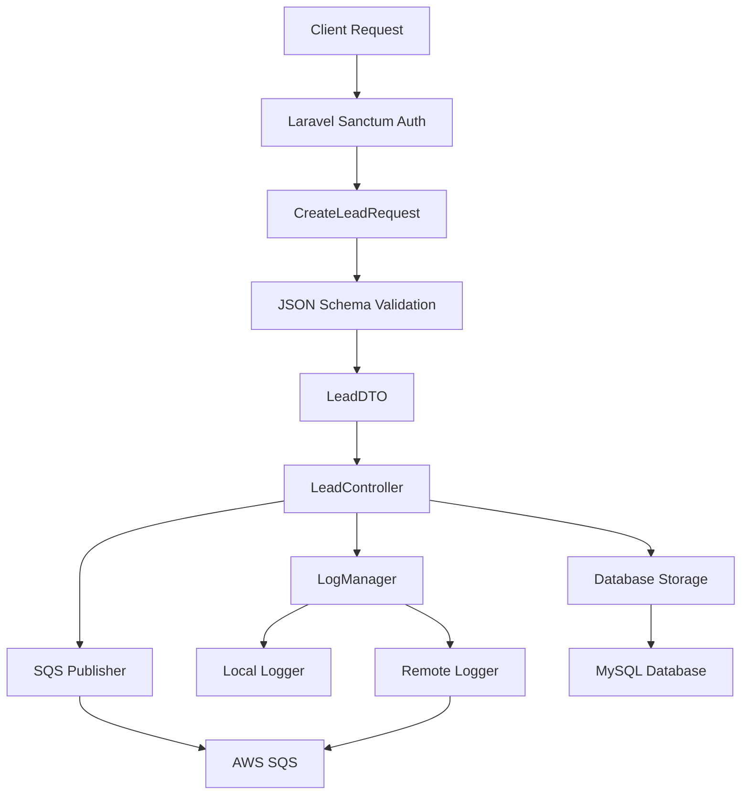

# PHP CRM Gateway

A Laravel 11 API gateway that validates lead submissions and publishes LeadCreated events to AWS SQS with switchable logging capabilities.

## 🏗️ Architecture Overview

This API gateway implements a clean architecture pattern with the following key components:

- **FormRequest + DTO + JSON Schema validation** for robust data validation
- **AWS SQS integration** with message attributes (CorrelationId, TenantId)
- **Switchable logging system** (local/remote/both) using SQS for remote logging
- **Laravel Sanctum** for API authentication
- **Comprehensive testing** with PHPUnit (feature, unit, integration tests)
- **OpenAPI documentation** with Swagger UI



## 🚀 Quick Start

### Prerequisites

- Docker and Docker Compose
- PHP 8.2+
- Composer

### Local Development Setup

1. **Clone and setup the project:**
   ```bash
   git clone <repository-url>
   cd php-crm-gateway
   cp .env.example .env
   ```

2. **Start the services:**
   ```bash
   docker-compose up -d
   ```

3. **Install dependencies and setup database:**
   ```bash
   docker-compose exec app composer install
   docker-compose exec app php artisan key:generate
   docker-compose exec app php artisan migrate
   docker-compose exec app php artisan db:seed
   ```

4. **Generate API documentation:**
   ```bash
   docker-compose exec app php artisan l5-swagger:generate
   ```

5. **Access the application:**
   - API: http://localhost:8080/api
   - Swagger UI: http://localhost:8080/api/documentation
   - LocalStack SQS: http://localhost:4566

### AWS Production Setup

1. **Create SQS Queues:**
   ```bash
   aws sqs create-queue --queue-name leads-queue
   aws sqs create-queue --queue-name log-events-queue
   ```

2. **Configure IAM permissions:**
   ```json
   {
     "Version": "2012-10-17",
     "Statement": [
       {
         "Effect": "Allow",
         "Action": [
           "sqs:SendMessage",
           "sqs:GetQueueAttributes"
         ],
         "Resource": [
           "arn:aws:sqs:*:*:leads-queue",
           "arn:aws:sqs:*:*:log-events-queue"
         ]
       }
     ]
   }
   ```

3. **Update environment variables:**
   ```env
   AWS_ACCESS_KEY_ID=your-access-key
   AWS_SECRET_ACCESS_KEY=your-secret-key
   AWS_DEFAULT_REGION=us-east-1
   AWS_SQS_QUEUE_URL=https://sqs.us-east-1.amazonaws.com/123456789012/leads-queue
   AWS_SQS_LOG_QUEUE_URL=https://sqs.us-east-1.amazonaws.com/123456789012/log-events-queue
   LOG_MODE=remote
   ```

## 📚 API Usage

### Authentication

1. **Generate API token:**
   ```bash
   curl -X POST http://localhost:8080/api/auth/token \
     -H "Content-Type: application/json" \
     -d '{
       "email": "admin@example.com",
       "password": "password"
     }'
   ```

2. **Use token in requests:**
   ```bash
   curl -X POST http://localhost:8080/api/leads \
     -H "Authorization: Bearer YOUR_TOKEN" \
     -H "Content-Type: application/json" \
     -d '{
       "email": "john@example.com",
       "first_name": "John",
       "last_name": "Doe",
       "phone": "+1234567890",
       "company": "Acme Corp",
       "source": "website",
       "metadata": {
         "utm_source": "google",
         "utm_medium": "cpc",
         "utm_campaign": "summer-sale"
       }
     }'
   ```

### API Endpoints

| Method | Endpoint | Description | Auth Required |
|--------|----------|-------------|---------------|
| GET | `/api` | API information | No |
| POST | `/api/auth/token` | Generate API token | No |
| POST | `/api/auth/logout` | Revoke API token | Yes |
| POST | `/api/leads` | Create a new lead | Yes |
| GET | `/api/documentation` | Swagger UI | No |

## 🔧 Configuration

### Logging Modes

The `LOG_MODE` environment variable controls how logs are handled:

- **`local`** (default): Log to local files only
- **`remote`**: Log to SQS only
- **`both`**: Log to both local files and SQS

### Environment Variables

Key environment variables:

```env
# Application
APP_NAME="PHP CRM Gateway"
APP_URL=http://localhost:8080

# Database
DB_CONNECTION=mysql
DB_HOST=mysql
DB_DATABASE=php_crm_gateway
DB_USERNAME=laravel
DB_PASSWORD=laravel

# Logging
LOG_MODE=local

# AWS Configuration
AWS_ACCESS_KEY_ID=test
AWS_SECRET_ACCESS_KEY=test
AWS_DEFAULT_REGION=us-east-1
AWS_SQS_QUEUE_URL=http://localstack:4566/000000000000/leads-queue
AWS_SQS_LOG_QUEUE_URL=http://localstack:4566/000000000000/log-events-queue

# Sanctum
SANCTUM_STATEFUL_DOMAINS=localhost:8080,127.0.0.1:8080
```

## 🧪 Testing

### Run Tests

```bash
# Run all tests
docker-compose exec app php artisan test

# Run specific test suites
docker-compose exec app php artisan test --testsuite=Feature
docker-compose exec app php artisan test --testsuite=Unit
docker-compose exec app php artisan test --testsuite=Integration

# Run with coverage
docker-compose exec app php artisan test --coverage
```

### Test Categories

- **Feature Tests**: End-to-end API testing (`tests/Feature/`)
- **Unit Tests**: Individual service testing (`tests/Unit/`)
- **Integration Tests**: SQS integration with LocalStack (`tests/Integration/`)

## 📊 Monitoring & Logging

### Local Logging

Logs are written to `storage/logs/laravel.log` when `LOG_MODE=local` or `LOG_MODE=both`.

### Remote Logging

When `LOG_MODE=remote` or `LOG_MODE=both`, logs are published to the SQS log-events queue with the following structure:

```json
{
  "level": "info",
  "message": "Lead created successfully",
  "context": {
    "lead_id": 1,
    "correlation_id": "uuid",
    "tenant_id": "1",
    "email": "john@example.com"
  },
  "timestamp": "2023-01-01T00:00:00Z",
  "correlation_id": "uuid",
  "tenant_id": "1"
}
```

### SQS Message Attributes

LeadCreated events include these message attributes:

- `EventType`: "LeadCreated"
- `CorrelationId`: Unique identifier for tracking
- `TenantId`: User/tenant identifier
- `Timestamp`: ISO 8601 timestamp

## 🔍 Troubleshooting

### Common Issues

1. **SQS Connection Failed**
   - Check AWS credentials and region
   - Verify queue URLs are correct
   - Ensure IAM permissions include SQS:SendMessage

2. **Database Connection Issues**
   - Verify MySQL container is running
   - Check database credentials in `.env`
   - Run migrations: `php artisan migrate`

3. **Authentication Errors**
   - Verify Sanctum configuration
   - Check token format: `Bearer <token>`
   - Ensure user exists in database

4. **LocalStack Issues**
   - Verify LocalStack container is running
   - Check LocalStack logs: `docker-compose logs localstack`
   - Ensure queues exist in LocalStack

### Debug Mode

Enable debug mode for detailed error information:

```env
APP_DEBUG=true
LOG_LEVEL=debug
```

## 🏗️ Development

### Project Structure

```
app/
├── Contracts/           # Service interfaces
├── DTOs/               # Data Transfer Objects
├── Http/
│   ├── Controllers/Api/ # API controllers
│   └── Requests/       # Form request validation
├── Models/             # Eloquent models
├── Services/
│   ├── Logging/        # Logging strategies
│   ├── Messaging/      # SQS publisher
│   └── Validation/     # JSON Schema validator
└── Providers/          # Service providers

resources/
└── schemas/            # JSON Schema definitions

tests/
├── Feature/            # End-to-end tests
├── Integration/        # SQS integration tests
└── Unit/              # Unit tests
```

### Adding New Features

1. **Create DTO** for data transfer
2. **Add JSON Schema** for validation
3. **Create FormRequest** with validation rules
4. **Implement service** with interface
5. **Add controller** with OpenAPI annotations
6. **Write tests** (feature, unit, integration)
7. **Update documentation**

## 📄 License

This project is licensed under the MIT License - see the [LICENSE](LICENSE) file for details.

## 🤝 Contributing

1. Fork the repository
2. Create a feature branch
3. Make your changes
4. Add tests for new functionality
5. Ensure all tests pass
6. Submit a pull request

## 📞 Support

For support and questions:

- Create an issue in the repository
- Check the [troubleshooting section](#troubleshooting)
- Review the [API documentation](http://localhost:8080/api/documentation)